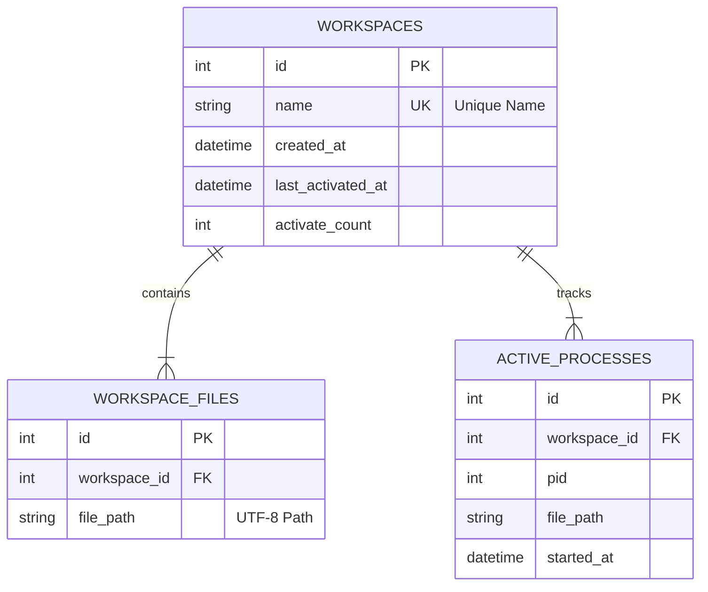

# QuickStart_cli Design Document

## 1. System Architecture

The application follows a layered architecture to ensure separation of concerns and maintainability.

```mermaid
graph TD
    User[User] -->|Commands| CLI[CLI Layer (Typer)]
    CLI -->|Logic Calls| WM[Workspace Manager]
    WM -->|Data Access| DB[Database Manager]
    WM -->|Process Control| Proc[Process Management]
    DB -->|SQL| SQLite[(SQLite Database)]
```

### Output Philosophy
- **Silent on Success**: Commands that successfully execute an action (like `start`, `stop`, `build`) should produce **no output** unless there is an error or the user explicitly requests status (e.g., `ls` or verbose flag).
- **Error Reporting**: Errors should be printed clearly to stderr (or red text via `rich`).


### Layers
- **CLI Layer (`main.py`, `commands.py`)**: Handles user input, argument parsing, and output formatting. Uses `typer`.
- **Logic Layer (`workspace_manager.py`)**: Contains the core business logic (creating, starting, listing, deleting workspaces).
- **Data Layer (`database_manager.py`)**: Handles all database interactions, connections, and migrations.

## 2. Directory Structure

```text
QuickStart_cli/
├── src/
│   ├── __init__.py
│   ├── main.py              # Entry point
│   ├── config.py            # Global configs (DB path, etc.)
│   ├── database_manager.py  # DB connection & queries
│   ├── workspace_manager.py # Logic for building/starting workspaces
│   └── utils.py             # Helpers (e.g., file dialogs)
├── tests/
│   ├── test_db.py
│   └── test_manager.py
├── requirements.txt
├── README.md
├── plan.md
└── design.md
```

## 3. Database Design

### Schema



### Tables

1.  **`workspaces`**
    *   `id`: Primary Key.
    *   `name`: Unique identifier for the workspace (User facing).
    *   `created_at`: Audit field.
    *   `last_activated_at`: To sort by "Recently Used".
    *   `activate_count`: Analytics / Frequently used.

2.  **`workspace_files`**
    *   `id`: Primary Key.
    *   `workspace_id`: Foreign Key to `workspaces`.
    *   `file_path`: Absolute path to the file/executable.

3.  **`active_processes`**
    *   `id`: Primary Key.
    *   `workspace_id`: Foreign Key to `workspaces`.
    *   `pid`: Process ID of the launched application.
    *   `file_path`: Path of the running file.
    *   `started_at`: Timestamp of launch.

## 4. detailed Component Design

### 4.1 DatabaseManager (`database_manager.py`)
*   **Responsibilities**:
    *   Initialize DB file (if not exists).
    *   Create tables (Migration).
    *   Execute queries safely (Context Manager pattern).
*   **Key Methods**:
    *   `initialize_db()`
    *   `get_connection()`
    *   `execute_query(query, params)`

### 4.2 WorkspaceManager (`workspace_manager.py`)
*   **Responsibilities**:
    *   Validate workspace names.
    *   Orchestrate adding files to a workspace.
    *   Launch files and track PIDs.
    *   Terminate running workspaces.
*   **Key Methods**:
    *   `create_workspace(name, file_paths)`: Transactional insert.
    *   `start_workspace(name)`: Fetch paths, call `subprocess.Popen`, store PIDs in `active_processes`.
    *   `stop_workspace(name)`: Fetch PIDs, terminate processes, clear DB entries.
    *   `list_workspaces()`: Return DTOs/Dicts for the CLI to print.
    *   `delete_workspace(name)`: Remove from both tables.

### 4.3 CLI (`main.py`)
*   **Dependencies**: `typer`, `rich` (for tables).
*   **Commands**:
    *   `ls`: Calls `list_workspaces()`, renders `rich.table.Table`.
    *   `build`: Prompts name, calls `utils.open_file_picker()`, accumulates paths, calls `create_workspace()`.
    *   `start`: Calls `start_workspace()`. Captures specific exceptions (e.g., `FileNotFoundError`) and prints warnings, otherwise silent.
    *   `stop`: Calls `stop_workspace()`. Prints result of termination (success/failure).
    *   `delete`: Calls `delete_workspace()` after confirmation.

## 5. Security & Localization
- **Data Persistence**:
    - Data is stored locally in the `data/` directory within the project root.
    - Ensures portability and visibility of data files in the working directory.
- **SQL Injection**: Prevented by using parameterized queries (`?`) in `sqlite3`.
- **Path Handling**:
    - All paths stored as absolute paths.
    - Python strings are Unicode by default, handling Chinese/Japanese characters.
    - `os.startfile` handles Unicode paths correctly on Windows.

## 6. Future Improvements
- **Startup folder**: Option to auto-run a workspace on Windows login.
- **GUI Manager**: A separate PySide/Tkinter app that uses the same `database.db` for management.
