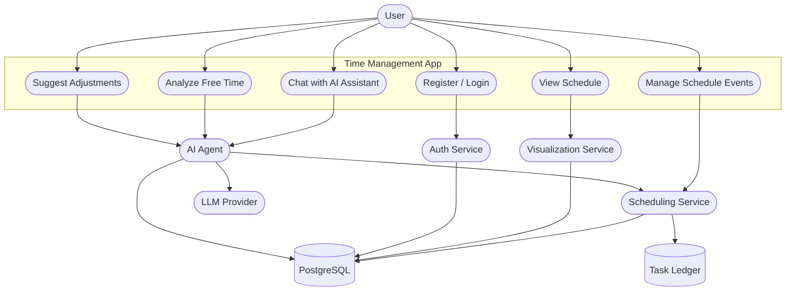

# Use Case Analysis

## 1. Primary and Secondary Actors

### Primary Actor
- **User** (student or planner using the app to manage time and tasks)

### Secondary Actors
- **AI Agent** (interprets natural language, calls tools)
- **Auth Service** (JWT-based authentication)
- **Scheduling Service** (CRUD for schedules and instances)
- **Visualization Service** (daily/weekly/monthly data)
- **Database** (PostgreSQL for persistence)
- **Task Ledger** (immutable audit of task actions)
- **LLM Provider** (Ollama or Claude for inference)

---

## 2. Use Cases by Actor

### User
- Register account
- Log in and receive JWT
- Create schedule event (single or recurring)
- View schedule (daily, weekly, monthly)
- View event details
- Update schedule event (single or recurring instance)
- Delete schedule event
- Ask AI for current schedule ("Where should I go now?")
- Ask AI to analyze free time
- Ask AI to suggest adjustments for conflicts

### AI Agent
- Parse user intent from chat
- Validate and structure output
- Call schedule tools (create, modify, delete)
- Retrieve current schedule and upcoming events
- Analyze free time gaps
- Suggest conflict-aware adjustments

### Auth Service
- Register user account
- Authenticate user credentials
- Issue JWT token

### Scheduling Service
- Create schedule event
- Generate schedule instances for recurrence
- Read list of events and details
- Update events or instances
- Delete events or instances

### Visualization Service
- Provide daily schedule data
- Provide weekly schedule data
- Provide monthly schedule data

### Database
- Store users, schedules, instances, notifications
- Query current and upcoming schedule
- Persist updates and deletions

### Task Ledger
- Record schedule creation
- Record schedule modification
- Record task completion

### LLM Provider
- Provide natural language inference
- Support AI responses and reasoning

---

## 3. Use Case Diagram (Main Use Cases)

